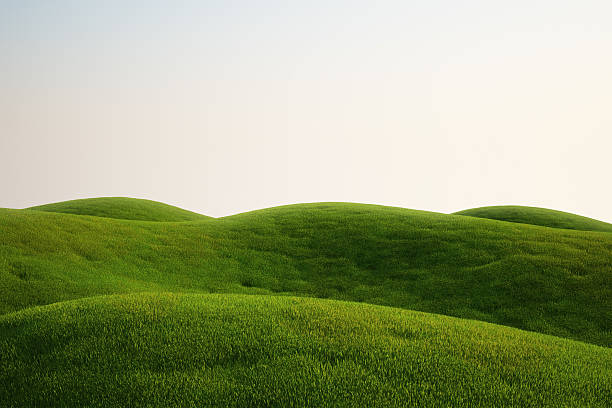

🌄 **Bem-vindo ao “Exemplo de Colina”!** 🌄

Que tal começar o dia com o pé na trilha e o coração cheio de paz? Neste post, vamos compartilhar aquela caminhadinha bucólica perfeita para recarregar as energias, respirar ar puro e contemplar paisagens de tirar o fôlego.

---

## 🥾 Preparativos Essenciais

1. **Calçado Confortável** – Opte por botas ou tênis de trilha com bom amortecimento.  
2. **Hidratação** – Leve ao menos 1,5 L de água em uma mochila leve.  
3. **Proteção Solar** – Chapéu, óculos escuros e protetor solar com FPS alto.  
4. **Lanchinhos** – Barrinhas de cereal, frutas secas e castanhas são ótimas escolhas.

---

## 🌱 O Caminho

A trilha começa na base da colina, passando por um trecho sombreado de eucaliptos. Conforme o sol sobe, as árvores dão lugar a campos dourados. Durante o percurso, há pequenas elevações—ótimas para pausas rápidas e fotos memoráveis! 📸

---

## 🌅 A Chegada ao Topo

Ao chegar ao cume, você será presenteado com uma vista panorâmica de 360°: morros ondulados, vales verdes e um céu que parece pintado à mão. É o lugar perfeito para um momento de contemplação ou mesmo um piquenique improvisado. 🧺

---

**Dicas finais:**  
- Chegue cedo para evitar o calor do meio-dia.  
- Respeite o ecossistema: não deixe lixo e mantenha o silêncio para apreciar os sons da natureza.  

---

✨ Até a próxima aventura! Que essa colina inspire muitas outras caminhadas cheias de paz e bem-estar. ✨
