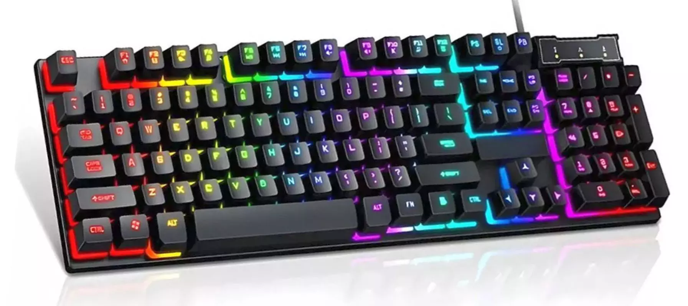

⌨️ **Bem-vindo à jornada do teclado mecânico!** ⌨️

Quem nunca ficou horas pesquisando, comparando e testando opções até encontrar o setup perfeito? Neste post, compartilho como escolhi cada componente do meu teclado mecânico — desde o clique dos switches até a sensação das keycaps.

---

## 🔍 Pesquisa Inicial

- **Switches**  
  - *Linear* (suave e silencioso)  
  - *Táctil* (feedback sem clique alto)  
  - *Clicky* (alto e satisfatório “clack!”)  
- **Layout**  
  - TKL (80%) vs. Full-Size (100%) vs. Compacto (60%)  
- **Keycaps**  
  - ABS (mais brilhantes) vs. PBT (maior durabilidade)  
  - Perfil OEM vs. Cherry vs. SA  

---

## 🛠️ Critérios de Escolha

1. **Conforto de Digitação**  
   - Testei cada switch por 30 minutos de digitação intensa.  
2. **Nível de Ruído**  
   - Ambiente de home office exige clicks suaves.  
3. **Estética e Iluminação**  
   - Backlight RGB branco para foco sem distração.  
4. **Durabilidade**  
   - Keycaps PBT e switches com vida útil ≥ 50 milhões de toques.  

---

## 🎯 Meu Setup Final

- **Switches:** Gateron G Pro (táctil, 67 g)  
- **Keycaps:** PBT Dye-Sub, perfil Cherry  
- **Layout:** TKL (80%)  
- **Case & Plate:** Alumínio escovado + plate em PC  

O resultado? Uma digitação fluida, feedback consistente e um som agradável sem incomodar ninguém ao redor. 🙌

---

## 🔧 Dicas de Manutenção

- **Limpeza periódica** (a cada 3 meses):  
  - Remova as keycaps e limpe com pincel macio.  
- **Lubrificação leve** nos switches (opcional):  
  - Use lubrificante específico para switches mecânicos.  
- **Verificação de conexões:**  
  - Confirme o cabo USB e, se for Wireless, recarregue a bateria.  

---

✨ **Conclusão:** Escolher um teclado mecânico é uma experiência personalizada. Teste diferentes combinações, ouça seu próprio gosto e divirta-se no processo!  

Se você já tem um teclado ou está pensando em comprar, conte sua história nos comentários! 👇
