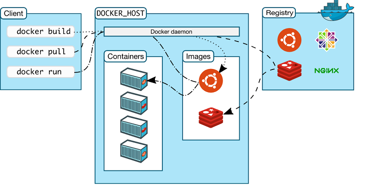

🐳 **Orquestrando seus containers com Docker Compose** 🐳



Quer rodar sua aplicação web, API e banco de dados localmente com um só comando? O Docker Compose é a solução perfeita! Abaixo, um **docker-compose.yml** pronto para copiar e colar:

```yaml
version: "3.8"

services:
  web:
    image: node:18-alpine
    working_dir: /app
    volumes:
      - ./web:/app
    command: sh -c "npm install && npm run dev"
    ports:
      - "3000:3000"
    depends_on:
      - api

  api:
    image: python:3.11-alpine
    working_dir: /app
    volumes:
      - ./api:/app
    command: sh -c "pip install -r requirements.txt && uvicorn main:app --host 0.0.0.0 --reload"
    ports:
      - "8000:8000"
    environment:
      - DATABASE_URL=postgresql://postgres:postgres@db:5432/mydb
    depends_on:
      - db

  db:
    image: postgres:15-alpine
    volumes:
      - db-data:/var/lib/postgresql/data
    environment:
      - POSTGRES_USER=postgres
      - POSTGRES_PASSWORD=postgres
      - POSTGRES_DB=mydb
    ports:
      - "5432:5432"

volumes:
  db-data:
```

## Passo a passo

1. **Crie a estrutura de pastas**

   ```bash
   mkdir meu-projeto && cd meu-projeto
   mkdir web api
   ```
2. **Adicione seu front-end em `web/` e sua API em `api/`.**

3. **Salve este conteúdo** em `docker-compose.yml` na raiz do projeto.

4. **Execute**
   ```bash
   docker-compose up --build
   ```
   (use `-d` para rodar em segundo plano)

✨ Pronto! Seu ambiente web + API + banco está orquestrado com um único comando. ✨
