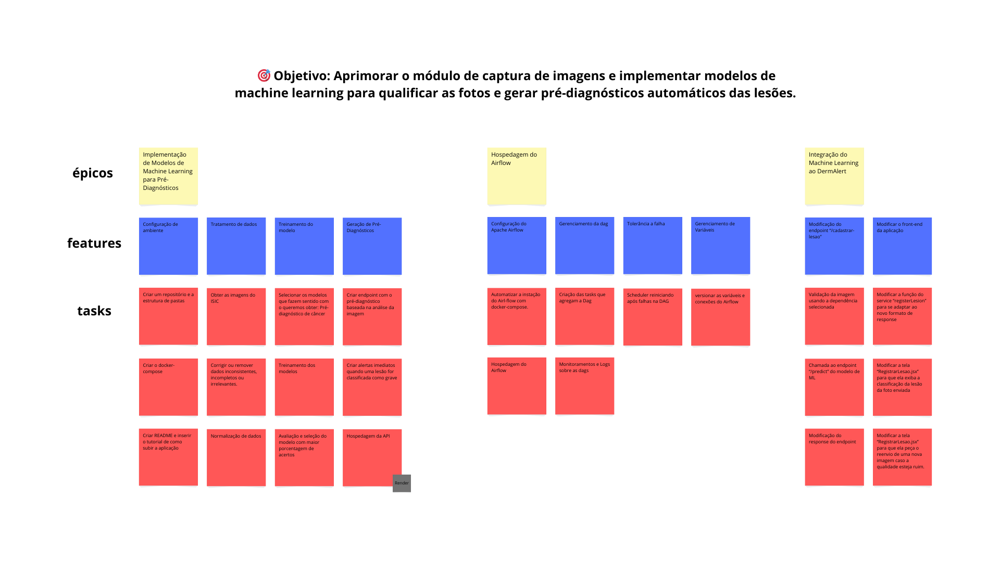

# Backlog

<!--  -->

| Versão | Data | Descrição | Autor | Revisor |
| :----: | ---- | --------- | ----- | ------- |
| `1.0`  |20/04/2025| Criação da página do Backlog | [Henrique Galdino](https://github.com/hgaldino05) |[Vitor Pereira](https://github.com/vcpvitor)  |